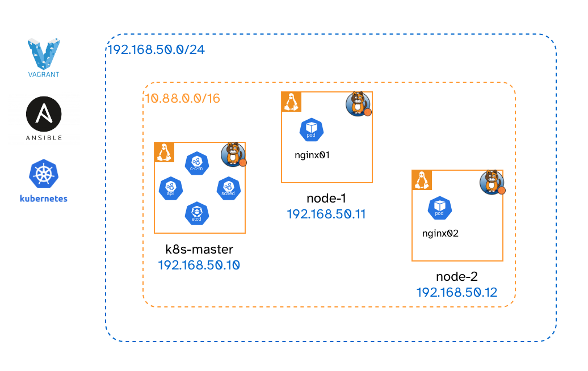

# Local Kubernetes cluster with Vagrant and Ansible
A local kubernetes cluster with a single master and multiple worker nodes, provisioned with Vagrant and Ansible.


## Requirements
- [Install Vagrant](https://developer.hashicorp.com/vagrant/docs/installation)
- [Install Ansible](https://docs.ansible.com/ansible/latest/installation_guide/intro_installation.html)
- [Install a Vagrant provider](https://developer.hashicorp.com/vagrant/docs/providers) (e.g. virtualbox, vmware, ...)


## Setup



- x1 Master Node
  - hostname: `k8s-master`
  - memory: `2GiB`
  - cpus: `2`
  - ip: `192.168.50.10`

- x2 Worker Nodes (can be changed by modifing `NUM_WORKERS` in the `Vagrantfile`)
  - hostnames: `node-1, node-2`
  - memory: `2GiB`
  - cpus: `2`
  - ips: `192.168.50.11, 192.168.50.12`

- Network: '192.168.50.0/24'

- Pod Cluster Network: '10.88.0.0/16'

## Versions

- Kubernetes v1.30 (Latest version: https://kubernetes.io/releases/)
- Containerd v1.7.16 (Latest version: https://github.com/containerd/containerd/releases)
- Runc v1.1.12 (Latest version: https://github.com/opencontainers/runc/releases)
- CNI Plugins 1.4.1 (Latest version: https://github.com/containernetworking/plugins/releases)
- Calico v3.28.0 (Latest version: https://github.com/projectcalico/calico/releases)
- Ubuntu 23.10 - ubuntu/mantic64 (Latest version: https://app.vagrantup.com/ubuntu)

All versions are parameterized. You can edit them in the `Vagrantfile`.


## Building the Cluster

To build the whole cluster:

1. `cd` into the repository
2. Run: `vagrant up` (this will also execute the Ansible playbooks)
3. Wait for the whole process to finish


## Context

The Ansible playbooks follow the official Kubernetes documentation for creating a cluster with `kubeadm`.
- https://kubernetes.io/docs/setup/production-environment/tools/kubeadm/install-kubeadm/
- https://kubernetes.io/docs/setup/production-environment/tools/kubeadm/create-cluster-kubeadm/
The hardware requirements for `kubeadm` are set in the `Vagrantfile`.

Containerd and its dependencies are installed from source, because the official Ubuntu repo version is broken.
- If your pods hang on deletion or similar, it might be due to the Ubuntu version.

After building the cluster, the `kubernetes-setup` folder will contain the `kubectl` config file named `kube-config`, if you want to copy it to your host machine.
Otherwise, you can run `kubectl` from the master node, where it is already configured.

To `ssh` into the master, use:
```bash
vagrant ssh k8s-master
```


## Deploying Pods

After successful completion of the `Vagrantfile` you can deploy pods.
Here's an example of x2 nginx Pods with a Service/Nodeport loadbalancing between them.

```bash
# Deploy the pods
kubectl run --image=nginx --port=80 nginx01
kubectl run --image=nginx --port=80 nginx02

# Check that the pods are running and note on which node they are deployed
kubectl get pods -o wide

# Tag the with some common labels (e.g. name=myapp)
kubectl label pod/nginx01 name=myapp
kubectl label pod/nginx02 name=myapp

# Create a Node Port Service that will listen on port 35321
kubectl create service nodeport myapp --tcp=35321:80

# Specify the selector to be name=myapp so that it loadbalances between the nginx pods
kubectl set selector svc/myapp name=myapp

# See the node port it listens on
kubectl describe svc/myapp
# At the line "NodePort:" see the second value with format <PORT>/TCP
```

At this point, we have a Node Port Service listening on `<PORT>`.
We can now access the nginx pods from our browser using any of the node's IP addresses.

For example, in your browser type: `192.168.50.11:<PORT>`

But to see that the Service actually loadbalances between the two pods, we can edit the nginx `index.html` file.

```bash
# Enter into the pod/nginx01's shell
kubectl exec -it nginx01 -- bash

# Change nginx to nginx01
sed -i 's/nginx\!/nginx01\!/' /usr/share/nginx/html/index.html

# Enter into the pod/nginx02's shell
kubectl exec -it nginx02 -- bash

# Change nginx to nginx01
sed -i 's/nginx\!/nginx02\!/' /usr/share/nginx/html/index.html
```

Now go back to the browser and (hard) reload the page.
You should see the page switch between "Welcome to nginx01!" and "Welcome to nginx02!".

Hurray! We have a working cluster :)
